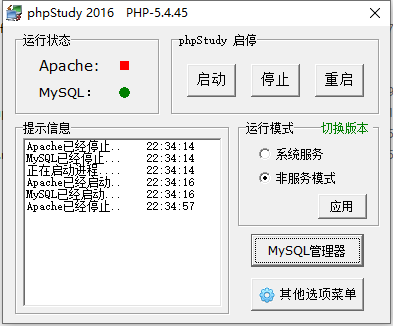
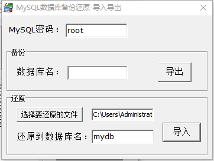

# vue_shop

### 关于 vue_shop
该课程是B站的[黑马程序员放出来的免费视频](https://www.bilibili.com/video/BV1x64y1S7S7?p=193&spm_id_from=pageDriver)来的，视频看到了P180 左右，后面的没有在看，后面功能在前面基本都涉及了，还有一些上线部署的东西。

在运行之前需要先将准备好的后端程序安装好，并启动。
1. .vue-项目实战day1\素材\phpStudy20161103.exe 安装

2. 运行后会有一个 mysql 服务启动
  
    
3. 点击 MYSQL 管理器 -> MYSQL 导入导出
4. 
    

    > 密码和数据库名都是固定的，不能改，选择要还原的文件，选择官方提供的素材的地址处文件
      vue-项目实战day1\素材\vue_api_server\db，
      然后点击导入，会弹出黑色框，是在执行初始化数据库的操作，会执行一会，执行结束之后，黑色框会自动推出，此时数据库准备好了。
5. 启动后端PHP程序, 程序在官方提供的素材目录 3.vue-项目实战day1\素材\vue_api_server
  `node ./app.js`

6. 然后启动前端代码 `npm run serve`

## Project setup
```
npm install
```

### Compiles and hot-reloads for development
```
npm run serve
```

### Compiles and minifies for production
```
npm run build
```

### Lints and fixes files
```
npm run lint
```
